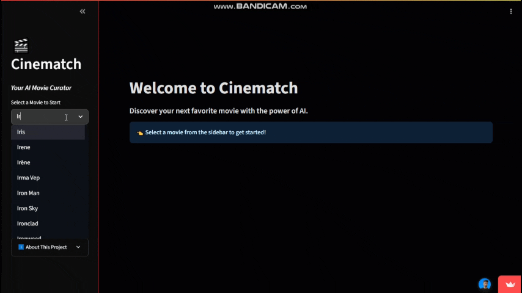

# 🎬 Cinematch: A Content-Based Movie Recommender System


An interactive movie recommender system built with Python and Streamlit. This application uses content-based filtering to suggest movies to users based on their thematic and stylistic similarity to a film they've selected.

---

## ✨ Live Demo

### [**>> Try the live app here! <<**](https://cinematch-movie-recommender-hcj3r46goeprn7a3cwhdhh.streamlit.app/)



---

## 🚀 Features

- **Content-Based Recommendations:** Select a movie and get 5 thematically similar suggestions.
- **Rich Movie Data:** Fetches posters, ratings, overviews, and genres from the TMDB API.
- **Interactive UI:** Built with Streamlit for a seamless and responsive user experience.
- **Discovery History:** The sidebar keeps track of your selections, allowing you to easily revisit previous recommendations.
- **Explainable Logic:** The underlying model prioritizes a director's "auteur signal," leading to insightful, style-based recommendations.

---

## 🛠️ Tech Stack & Methodology

This project is a complete end-to-end data science application, from data processing to model deployment.

- **Data Processing & EDA:** The project utilizes three datasets from Kaggle (movies metadata, credits, keywords). The data was cleaned, merged, and explored in a Jupyter Notebook to handle missing values and parse complex data types.
- **Feature Engineering:** The core of the recommender is a "feature soup" created for each movie. This is a combined text field containing:
  - Movie Overview
  - Genres
  - Keywords
  - Top 3 Cast Members
  - Director (weighted 3x to capture the "auteur signal")
- **Modeling:**
  - **`TfidfVectorizer`**: The "feature soup" for all 46,000+ movies was transformed into a numerical TF-IDF matrix.
  - **`NearestNeighbors`**: A K-Nearest Neighbors model was trained on this matrix using `cosine similarity` to find the movies with the most similar vector "fingerprints."
- **Deployment:**
  - The application is built with **Streamlit**.
  - It is deployed on **Streamlit Cloud** and connected directly to this GitHub repository.
  - API keys are securely handled using Streamlit's Secrets Management.

---

## 💻 Running the Project Locally

To run this project on your own machine, follow these steps:

1.  **Clone the repository:**

    ```bash
    git clone https://github.com/MuhammadTahir-1-9-4/cinematch-movie-recommender.git
    cd cinematch-movie-recommender
    ```

2.  **Set up a virtual environment (recommended):**

    ```bash
    python -m venv venv
    # On Windows
    venv\Scripts\activate
    # On macOS/Linux
    source venv/bin/activate
    ```

3.  **Install the required libraries:**

    ```bash
    pip install -r requirements.txt
    ```

4.  **Create your API key file:**

    - Get a free API key from [The Movie Database (TMDB)](https://www.themoviedb.org/settings/api).
    - In the project's root directory, create a file named `.env`.
    - Add the following line to the file, replacing `YOUR_KEY_HERE` with your actual key:
      ```
      TMDB_API_KEY="YOUR_KEY_HERE"
      ```
    - _(This file is included in `.gitignore` and will not be committed to GitHub.)_

5.  **Run the Streamlit app:**
    ```bash
    streamlit run app.py
    ```
    The application should now be running in your web browser!

---

## 📈 Future Improvements

- **Data Deduplication:** Implement a more robust method for handling duplicate movie titles by using the release year to create a unique identifier.
- **Hybrid Recommender:** Incorporate collaborative filtering (what "users like you" enjoyed) to add a layer of personalization.
- **Advanced NLP:** Use more sophisticated models like Word2Vec or BERT embeddings to capture deeper semantic meanings from movie overviews.

---

## 👤 Contact

Muhammad Tahir - [LinkedIn](https://www.linkedin.com/in/muhammad-tahir-data/)
